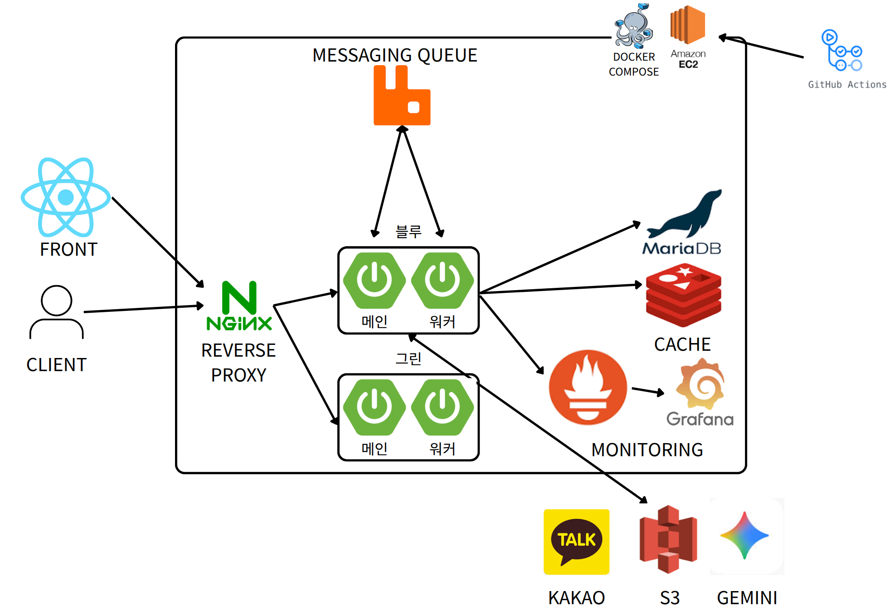

# Pullit 아키텍처 설계에 담긴 고민과 결정

이 문서는 Pullit의 현재 아키텍처가 만들어지기까지의 고민과 선택을 담은 기록입니다. 여러 배포 방식을 직접 써보며 비용, 안정성, 그리고 현재 단계에서의 학습 목표 사이의 균형점을 찾고자 했습니다. 특히 실제 사용자가 거의 없는 초기 프로젝트에서 **'무엇을 지금 도입하고 무엇을 나중으로 미룰 것인가'**가 핵심 과제였습니다. 덕분에 이러한 단순함 속에서 비즈니스 로직 개발이라는 본질에 더 많은 시간을 할애할 수 있었습니다.

## 1. 현재 아키텍처: 단순함 속의 효율성

현재 아키텍처는 단일 EC2 인스턴스 내에서 Nginx와 Spring Boot 애플리케이션이 동작하는 단순하지만 효율적인 구조를 가지고 있습니다.

### [흐름] 요청은 어떻게 처리되는가?

1.  **Client → Nginx:** 사용자의 모든 요청(HTTPS)은 Nginx를 통해 EC2 인스턴스로 들어옵니다. Nginx는 SSL 인증서를 처리하여 HTTPS 트래픽을 복호화(SSL Termination)하고, 리버스 프록시로서 요청을 내부 Spring Boot 애플리케이션으로 전달합니다. (운영 환경의 인증서는 **Certbot을 통해 Let's Encrypt에서 자동으로 발급 및 갱신**하고 있으며, 로컬 개발 과정에서는 `mkcert`를 사용해 신뢰할 수 있는 테스트 인증서를 발급함으로써 개발과 운영 환경의 HTTPS 설정을 거의 동일하게 유지했습니다.) => 이부분 배포하는 쪽에서 설명하도록 넘기자.
2.  **Nginx → Backend:** 백엔드 애플리케이션은 비즈니스 로직을 수행합니다. 이 과정에서 필요에 따라 외부 서비스(S3, Gemini, DB)와 통신하며 전체 프로세스를 조율(Orchestration)합니다.

## 2. 주요 설계 결정과 그 배경

### 파일 저장 (AWS S3): Presigned URL을 사용한 이유

사용자가 업로드하는 파일은 백엔드 서버를 거치지 않고 클라이언트에서 S3로 직접 전송됩니다. 백엔드는 S3에 파일을 올릴 수 있는 **임시 통행증(Presigned URL)을 발급**해주는 역할만 합니다. 이는 대용량 트래픽이 백엔드에 몰려 장애를 일으키는 상황을 원천 차단하기 위한 결정입니다. 서버는 비즈니스 로직 처리에만 집중할 수 있어 안정성과 성능 면에서 유리합니다.

### 데이터베이스 (MariaDB): 고정 비용을 피하는 실용주의

이전 프로젝트에서 RDB의 롤백 기능 등을 유용하게 사용했지만, 현재 Pullit은 실제 사용자가 거의 없는 초기 단계입니다. 이 상황에서 RDS와 같은 관리형 데이터베이스를 도입하면 월 고정 비용이 부담될 수 있습니다. 그래서 RDB의 장점은 유지하되, 비용 효율을 위해 **EC2 인스턴스에 직접 MariaDB를 설치해 사용**하고 있습니다.

## 3. 의도적으로 보류한 것들과 미래 계획

'무엇을 하지 않았는가'를 결정하는 것 또한 중요한 아키텍처 설계 과정이었습니다.

### [보류 1] 로드 밸런싱 (수평 확장)

로드 밸런싱을 도입하려면 백엔드 서버가 **상태를 갖지 않아야(Stateless)** 합니다. 하지만 현재 Pullit은 두 가지 기술적 한계로 인해 완전한 Stateless 구조가 아닙니다.

1.  **Spring Security OAuth2의 세션 의존성:** Spring OAuth2의 기본 구현체는 `state` 값, `redirect_uri` 등 인증 과정의 중요 정보를 HTTP 세션에 저장합니다. 이를 DB나 Redis 기반의 완전한 Stateless 방식으로 전환하려면 상당한 커스터마이징이 필요한데, 현재 단계에서는 투입할 시간 대비 효용이 낮다고 판단했습니다.
2.  **SSE(Server-Sent Events)의 인메모리 방식:** 실시간 알림에 사용되는 SSE 연결 정보가 현재는 각 서버의 메모리에 저장됩니다. 이 구조에서는 로드 밸런서를 통해 요청이 다른 서버로 분산될 경우 연결 정보를 유실하게 됩니다. 수평 확장을 위해서는 Redis Pub/Sub 등을 이용한 외부 메시지 브로커 도입이 선행되어야 합니다.

### [보류 2] 데이터베이스 서버 분리

현재는 비용 효율을 위해 백엔드와 DB 서버를 동일한 EC2 인스턴스에서 운영하고 있습니다. 이는 트래픽이 적은 초기 단계에서는 가장 합리적인 선택입니다. 하지만 향후 실제 사용자의 데이터가 쌓이고, **고객 정보에 대한 높은 수준의 복구 능력이 보장되어야 하는 시점**이 오면, EC2에서 직접 운영하는 대신 **AWS RDS와 같은 완전 관리형 데이터베이스 서비스로 전환**할 계획입니다.

이러한 결정들은 Pullit이 변화에 유연하게 대응하며 지속적으로 발전할 수 있는 튼튼한 기반이 될 것이라 믿습니다.
