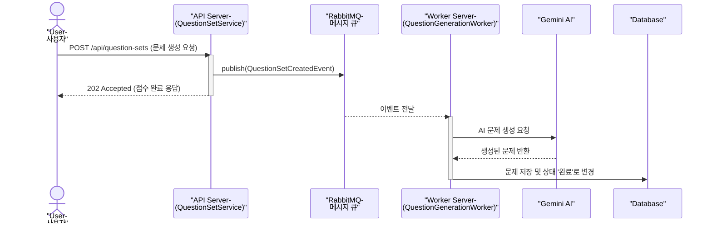
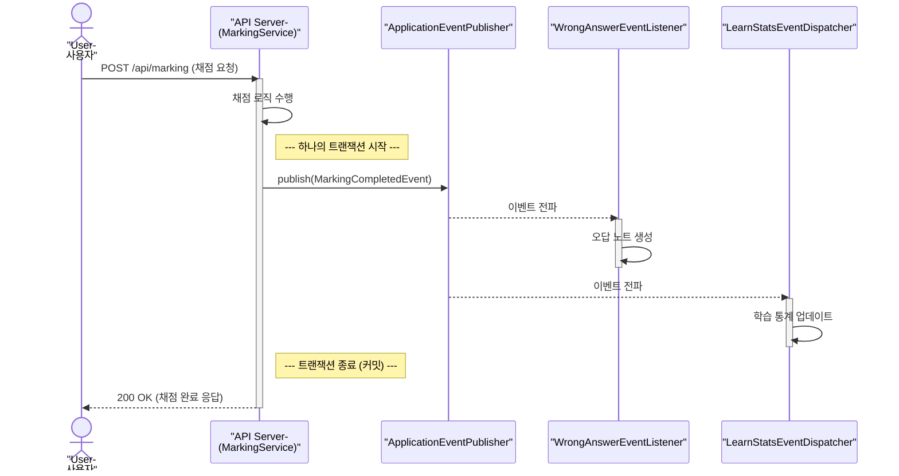

# Pullit의 이벤트 아키텍처: 비동기와 동기, 두 가지 접근법에 담긴 고민

이 문서는 Pullit이 어떻게 도메인 간의 의존성을 낮추고, 유연하며 확장 가능한 시스템을 구축했는지 이벤트 기반 아키텍처의 관점에서 설명합니다. 저희는 작업의 성격에 따라 **비동기 메시지 큐(RabbitMQ)**와 **동기 이벤트(`ApplicationEventPublisher`)**라는 두 가지 도구를 전략적으로 사용하여, '빠른 응답'과 '데이터 정합성'이라는 두 마리 토끼를 잡고자 했습니다.

## 1. 모든 것의 시작: 왜 이벤트인가? - 느슨한 결합(Loose Coupling)

이벤트 기반 아키텍처의 핵심 철학은 **"내 할 일은 끝났으니, 관심 있는 사람은 이어서 작업하세요!"** 라고 사내 게시판에 공지하는 것과 같습니다.

예를 들어, '채점 서비스'는 채점이 끝났다는 사실만 알리면 됩니다. 그 이후에 '오답노트 서비스'가 오답 노트를 만들든, '통계 서비스'가 학습 데이터를 기록하든 '채점 서비스'는 전혀 신경 쓰지 않습니다.

이렇게 각 서비스가 서로를 직접 호출하지 않고, 중간에 '이벤트'라는 공통의 신호를 통해 소통하는 방식을 **느슨한 결합(Loose Coupling)** 이라고 합니다. 이는 마치 A부서가 B부서에게 직접 전화하는 대신, A부서는 자기 일을 끝내고 사내 게시판에 '완료'라고 공지하고, 이 공지에 관심 있는 C부서와 D부서가 각자 알아서 다음 일을 시작하는 방식과 같습니다. 이 덕분에 C부서나 D부서의 일이 변경되어도 A부서의 코드는 전혀 수정할 필요가 없어지므로, 유지보수와 확장이 매우 유연해집니다.

## 2. 무거운 작업을 위한 해결사: 비동기 이벤트와 RabbitMQ

> **"AI 문제 생성은 수십 초에서 몇 분까지 걸릴 수 있습니다. 사용자를 마냥 기다리게 할 수는 없죠."**

AI 문제 생성처럼 시간이 오래 걸리는 작업은 사용자에게 즉시 응답을 주기 어렵습니다. 이 문제를 해결하기 위해 저희는 **RabbitMQ**라는 메시지 큐(우체국 시스템)를 도입했습니다.

### [흐름] AI 문제 생성은 어떻게 처리되는가?

1.  **요청 접수 및 위임**: 사용자가 문제 생성을 요청하면, API 서버는 무거운 AI 작업을 직접 수행하는 대신 **"문제 생성을 시작해주세요!"** 라는 편지(이벤트)를 작성하여 RabbitMQ라는 우체국에 보낸 뒤, 사용자에게는 즉시 "네, 접수되었습니다!"라고 응답을 보냅니다.
2.  **비동기 처리**: 별도의 서버에서 대기하고 있던 `QuestionGenerationWorker`는 우체국의 자기 우편함만 바라보고 있다가 새 편지가 도착하면 이를 가져와 실제 AI 문제 생성 작업을 시작합니다.
3.  **결과 반영**: 워커는 AI 모델 호출, 데이터베이스 저장 등 모든 무거운 작업을 백그라운드에서 완료하고, 작업이 끝나면 문제집의 상태를 '완료'로 변경합니다.

### [결정] 왜 RabbitMQ를 선택했나?

-   **빠른 사용자 응답**: 사용자는 오래 기다릴 필요 없이 즉시 다음 활동을 이어갈 수 있습니다.
-   **API 서버 안정성 확보**: 무거운 작업이 API 서버의 메모리나 CPU를 점유하지 않으므로, 다른 API 요청 처리에 영향을 주지 않아 전체 시스템이 안정적으로 운영됩니다.
-   **유연한 확장**: 만약 문제 생성 요청이 폭주한다면, 다른 부분은 그대로 둔 채 오직 Worker 서버의 수만 늘려서 더 많은 작업을 동시에 처리할 수 있습니다.

## 3. 데이터 정합성이 생명: 동기 이벤트와 ApplicationEventPublisher

> **"채점 직후, 오답노트 생성과 학습 통계 업데이트는 즉시, 그리고 원자적으로(All-or-Nothing) 일어나야 합니다."**

반면, 채점처럼 즉각적인 후속 조치가 필요하고 모든 과정이 하나의 트랜잭션으로 묶여야 하는 작업도 있습니다. 만약 채점은 성공했는데 오답노트 저장이 실패한다면 데이터가 어긋나 버리기 때문입니다.

이 경우, 저희는 Spring에 내장된 `ApplicationEventPublisher`를 사용한 **동기 이벤트 방식**을 사용합니다. 이는 외부 시스템(우체국)을 거치지 않고, 같은 사무실 내에서 사용하는 **'사내 메신저'** 와 같습니다.

### [흐름] 문제 채점은 어떻게 처리되는가?

1.  **채점 요청**: 사용자가 채점을 요청하면 `MarkingService`가 채점을 수행합니다.
2.  **동기 이벤트 발행**: 채점이 끝나면 `MarkingService`는 `ApplicationEventPublisher`를 통해 `MarkingCompletedEvent`라는 이벤트를 발행합니다.
3.  **즉각적인 후속 처리**: 이벤트를 구독하고 있던 `WrongAnswerEventListener`와 `LearnStatsEventDispatcher`가 **즉시** 호출됩니다. 이들은 각각 오답노트를 생성하고 학습 통계를 업데이트합니다.
4.  **최종 응답**: 이 모든 과정(채점, 오답노트 생성, 통계 업데이트)이 **하나의 트랜잭션** 안에서 성공적으로 끝나야만, 비로소 사용자에게 "채점 완료!" 응답이 돌아갑니다.

### [결정] 왜 ApplicationEventPublisher를 사용했나?

-   **강력한 데이터 정합성**: 모든 작업이 하나의 트랜잭션으로 묶여 있어, 중간에 하나라도 실패하면 모든 작업이 롤백됩니다.
-   **단순성**: 외부 메시지 큐 시스템 없이 Spring 프레임워크가 제공하는 기능만으로 구현할 수 있어 구조가 단순합니다.
-   **느슨한 결합 유지**: `MarkingService`는 여전히 후속 작업의 구체적인 내용을 알 필요 없이, 오직 이벤트만 발행하면 되므로 느슨한 결합의 장점을 그대로 유지할 수 있습니다.

## 4. 한눈에 보는 비동기 vs 동기 이벤트

| 구분 | 비동기 이벤트 (Asynchronous) | 동기 이벤트 (Synchronous) |
| :--- | :--- | :--- |
| **주요 도구** | RabbitMQ | `ApplicationEventPublisher` |
| **처리 시간** | 오래 걸리는 작업 (수십 초 ~ 수 분) | 즉각적인 처리가 필요한 빠른 작업 |
| **사용자 응답** | 즉시 응답 (작업 접수만 알림) | 모든 후속 작업이 끝나야 응답 |
| **트랜잭션** | 발행자와 소비자 간 별도 트랜잭션 | 모든 과정이 단일 트랜잭션으로 묶임 |
| **주요 사용처** | AI 문제 생성, 외부 시스템 연동 | **문제 채점 후 오답노트/통계 처리** |

이처럼 Pullit은 각기 다른 상황의 요구사항을 충족시키기 위해 동기 및 비동기 이벤트 처리 방식을 현명하게 조합하여, 빠르고 안정적이면서도 유연한 시스템 아키텍처를 구축했습니다.
