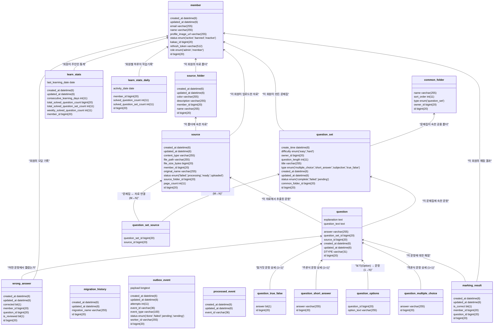

# Pullit 상세 데이터베이스 스키마

## 1. 개요

이 문서는 Pullit 프로젝트의 데이터베이스 스키마를 테이블 및 컬럼 레벨에서 상세히 설명합니다. 시스템을 구성하는 각 테이블의 목적, 주요 컬럼의 의미, 그리고 테이블 간의 관계(FK)를 명확히 하여 개발자가 데이터 구조를 깊이 이해할 수 있도록 돕습니다.

이 문서는 `STUDY_ERD.md`가 제공하는 상위 레벨의 개념적 모델을 보완하는 물리적 데이터 모델에 대한 기술 문서입니다.

## 2. 데이터베이스 스키마 다이어그램

아래 다이어그램은 데이터베이스의 전체 테이블과 컬럼, 그리고 테이블 간의 관계를 보여줍니다.

## 3. 테이블 상세 설명

### 3.1 사용자 도메인

#### `member`
- **목적**: 시스템 사용자의 정보를 저장합니다.
- **주요 컬럼**:
    - `id`: PK. 회원의 고유 식별자입니다.
    - `kakao_id`: 카카오에서 발급한 사용자 ID. 소셜 로그인을 위해 사용됩니다.
    - `email`: 회원 이메일. 로그인 및 알림에 사용됩니다. (UNIQUE)
    - `name`: 회원 이름.
    - `role`: 회원의 권한 (MEMBER, ADMIN).
    - `status`: 회원 계정 상태 (ACTIVE, INACTIVE, BANNED).
    - `refresh_token`: JWT 리프레시 토큰.

### 3.2 학습 소스 도메인

#### `source_folder`
- **목적**: 사용자가 업로드한 학습 자료(`source`)를 정리하는 폴더 정보를 저장합니다.
- **주요 컬럼**:
    - `id`: PK. 폴더의 고유 식별자입니다.
    - `member_id`: FK (`member.id`). 폴더의 소유자입니다.
    - `name`: 폴더 이름.

#### `source`
- **목적**: 문제 생성을 위해 사용자가 업로드한 원본 파일(PDF 등)의 메타데이터를 저장합니다.
- **주요 컬럼**:
    - `id`: PK. 학습 자료의 고유 식별자입니다.
    - `member_id`: FK (`member.id`). 자료의 소유자입니다.
    - `source_folder_id`: FK (`source_folder.id`). 자료가 속한 폴더입니다.
    - `original_name`: 사용자가 업로드한 파일의 원본 이름.
    - `file_path`: S3 등 파일 스토리지에 저장된 경로.
    - `status`: 자료의 처리 상태 (UPLOADED, PROCESSING, READY, FAILED).

### 3.3 문제 및 문제집 도메인

#### `question_set`
- **목적**: 하나의 문제집 정보를 저장합니다.
- **주요 컬럼**:
    - `id`: PK. 문제집의 고유 식별자입니다.
    - `owner_id`: FK (`member.id`). 문제집의 소유자입니다.
    - `common_folder_id`: FK (`common_folder.id`). 문제집이 속한 공용 폴더입니다.
    - `title`: 문제집 제목.
    - `status`: 문제집 생성 상태 (PENDING, COMPLETE, FAILED).

#### `question_set_source`
- **목적**: 문제집(`question_set`)과 학습 자료(`source`) 간의 다대다(M:N) 관계를 나타내는 조인 테이블입니다.
- **주요 컬럼**:
    - `question_set_id`: FK (`question_set.id`).
    - `source_id`: FK (`source.id`).

#### `question`
- **목적**: 모든 문제 유형의 공통 정보를 저장하는 부모 테이블 (JPA 상속 전략: JOINED).
- **주요 컬럼**:
    - `id`: PK. 문제의 고유 식별자입니다.
    - `question_set_id`: FK (`question_set.id`). 문제가 속한 문제집입니다.
    - `question_text`: 문제의 지문.
    - `explanation`: 문제 해설.
    - `DTYPE`: 자식 테이블을 구분하는 컬럼 (e.g., `MultipleChoiceQuestion`).

#### `question_multiple_choice`, `question_short_answer`, `question_true_false`
- **목적**: `question` 테이블을 상속받아 각 문제 유형별 고유 정보를 저장하는 자식 테이블입니다.
- **주요 컬럼**:
    - `id`: PK이자 FK (`question.id`).
    - `answer`: 각 문제 유형에 맞는 정답.

#### `question_options`
- **목적**: 객관식 문제(`question_multiple_choice`)의 선택지 목록을 저장합니다.
- **주요 컬럼**:
    - `question_id`: FK (`question.id`). 선택지가 속한 문제입니다.
    - `option_text`: 선택지 내용.

#### `marking_result`
- **목적**: 사용자가 푼 문제의 정답/오답 여부를 기록합니다.
- **주요 컬럼**:
    - `id`: PK.
    - `member_id`: FK (`member.id`). 문제를 푼 사용자입니다.
    - `question_id`: FK (`question.id`). 푼 문제입니다.
    - `is_correct`: 정답 여부.

#### `wrong_answer`
- **목적**: 틀린 문제를 기록하여 오답 노트를 제공하는 데 사용됩니다.
- **주요 컬럼**:
    - `id`: PK.
    - `member_id`: FK (`member.id`).
    - `question_id`: FK (`question.id`). 틀린 문제입니다.
    - `is_reviewed`: 사용자가 오답을 다시 확인했는지 여부.

### 3.4 폴더 도메인

#### `common_folder`
- **목적**: 현재는 문제집을 분류하는 용도로 사용되는 폴더입니다.
- **주요 컬럼**:
    - `id`: PK.
    - `owner_id`: FK (`member.id`). 폴더 소유자입니다.
    - `name`: 폴더 이름.
    - `type`: 폴더의 유형 (현재는 `question_set`만 존재).

### 3.5 통계 도메인 (프로젝션)

#### `learn_stats`
- **목적**: 사용자의 전체적인 학습 통계를 저장하여 빠른 조회를 지원합니다 (CQRS 읽기 모델).
- **주요 컬럼**:
    - `member_id`: PK이자 FK (`member.id`).
    - `total_solved_question_count`: 누적 푼 문제 수.
    - `consecutive_learning_days`: 연속 학습일.

#### `learn_stats_daily`
- **목적**: 일별 학습 통계를 저장합니다.
- **주요 컬럼**:
    - `id`: PK.
    - `member_id`: FK (`member.id`).
    - `activity_date`: 활동 날짜.
    - `solved_question_count`: 해당 날짜에 푼 문제 수.

### 3.6 인프라 도메인

#### `outbox_event`, `processed_event`
- **목적**: Outbox 패턴을 구현하여 트랜잭션 내에서 발생한 이벤트를 안정적으로 발행하고 처리하기 위해 사용됩니다.
- **주요 컬럼**:
    - `event_id`, `event_type`, `payload`, `status`.

#### `migration_history`
- **목적**: 데이터베이스 스키마 변경(마이그레이션) 기록을 관리합니다.
- **주요 컬럼**:
    - `migration_name`: 실행된 마이그레이션 스크립트의 이름.
