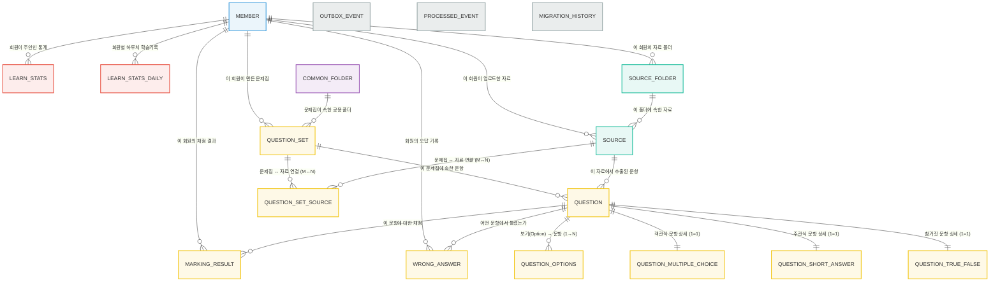

# Pullit 데이터베이스 ERD 가이드

## 1. 개요

이 문서는 Pullit 프로젝트의 핵심 도메인 엔티티와 그 관계를 설명하는 ERD(Entity Relationship Diagram) 가이드입니다. 새로운 팀원이 시스템의 데이터 모델을 빠르게 이해하고 개발에 참여할 수 있도록 돕는 것을 목표로 합니다.

전체 데이터베이스 구조는 주요 책임에 따라 다음과 같은 도메인으로 구분됩니다.

*   **사용자**: 회원 정보 관리
*   **학습 소스**: 문제 생성을 위한 원본 파일(PDF 등) 관리
*   **문제 및 문제집**: 생성된 문제와 문제집, 채점 결과, 오답 노트 관리
*   **폴더**: 학습 소스와 문제집을 정리하기 위한 폴더 관리
*   **통계**: 사용자의 학습 활동을 집계하는 데이터 (프로젝션)
*   **인프라**: 시스템의 안정적인 동작을 지원하는 기술적 엔티티

## 2. 전체 ERD

## 3. 핵심 도메인 설명

### 3.1 사용자 (Member)

*   `Member`: 시스템의 모든 활동 주체인 사용자입니다. 카카오 소셜 로그인을 통해 가입하며, 학습 소스, 문제집, 폴더 등 대부분의 데이터를 소유합니다.

### 3.2 학습 소스 (Learning Source)

*   `SourceFolder`: 사용자가 학습 소스(`Source`)를 정리하는 폴더입니다.
*   `Source`: 문제집을 생성하기 위해 사용자가 업로드하는 원본 파일(예: PDF) 정보입니다. `SourceFolder`에 속하며, 하나의 소스로 여러 문제집(`QuestionSet`)을 만들 수 있습니다.

### 3.3 문제 및 문제집 (Question & QuestionSet)

*   `QuestionSet`: `Source`로부터 생성된 문제들의 묶음입니다. 사용자가 소유하며, `CommonFolder`에 담아 분류할 수 있습니다.
*   `Question`: `QuestionSet`에 포함되는 개별 문제입니다. 객관식, 주관식, OX 문제 유형을 지원하기 위해 상속 구조(`JOINED` 전략)를 사용합니다.
    *   `TrueFalseQuestion`, `MultipleChoiceQuestion`, `ShortAnswerQuestion`이 `Question`을 상속받습니다.
    *   객관식 문제의 보기는 별도의 `question_options` 테이블에서 관리됩니다.
*   `MarkingResult`: 사용자가 특정 `Question`에 대해 제출한 답안의 채점 결과입니다.
*   `WrongAnswer`: 사용자가 틀린 `Question`을 기록하여 오답 노트를 만드는 데 사용됩니다.

### 3.4 폴더 (Folder)

*   `CommonFolder`: 현재는 `QuestionSet`을 분류하는 데 사용되는 공용 폴더입니다.

### 3.5 통계 (LearnStats Projection)

*   `LearnStats`, `LearnStatsDaily`: 사용자의 학습 활동(푼 문제 수, 연속 학습일 등)을 빠르게 조회할 수 있도록 별도로 집계한 데이터입니다. 이는 CQRS 패턴의 읽기 모델(Read Model)에 해당하며, 시스템 성능을 위해 정규화된 데이터와 별개로 유지됩니다.

### 3.6 인프라 (Infrastructure)

*   시스템의 안정적인 동작을 지원하는 기술적 엔티티를 포함합니다.
    *   `outbox_event`, `processed_event`: Outbox 패턴을 통해 도메인 이벤트의 안정적인 발행을 보장합니다.
    *   `migration_history`: 데이터베이스 스키마 변경 이력을 관리하여 형상 관리를 지원합니다.