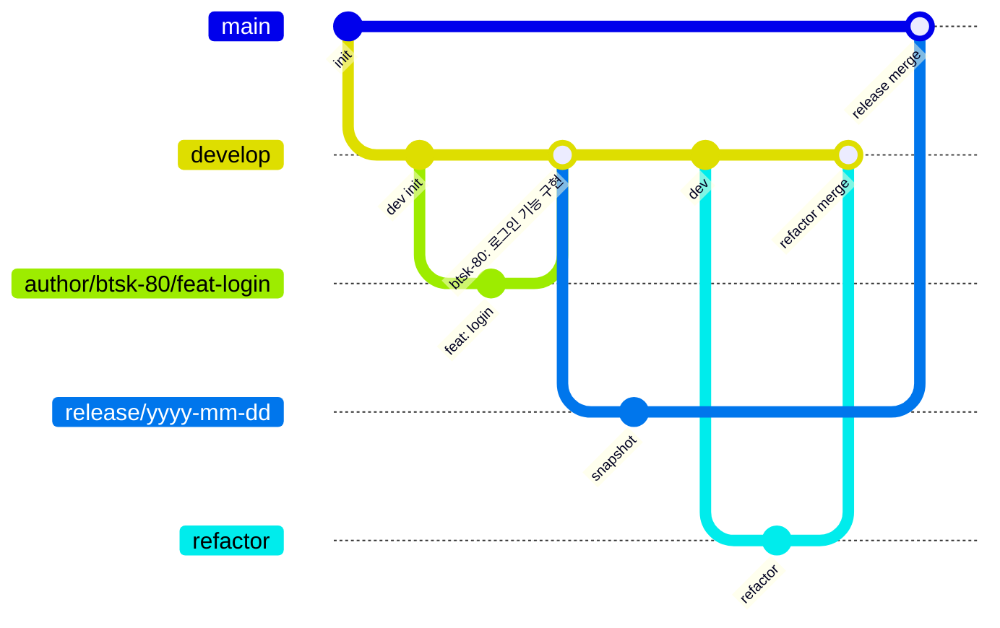

# Git 컨벤션

## 브랜치 전략

우리 팀은 아래와 같은 GitFlow 기반의 브랜치 전략을 사용합니다.

## 브랜치 종류

- `main`: 배포 이력을 관리하는 브랜치입니다. (태그/릴리스 전용)
- `develop`: 모든 기능 브랜치가 통합되고 검증되는 통합 브랜치입니다.
- `release/yyyy-mm-dd`: 배포를 위한 스냅샷 브랜치입니다. 카카오 테크 캠퍼스 정책에 따라 `develop`의 내용을 `main`으로 반영할 때 사용하지만, 실제 서버 배포는 `develop` 브랜치를 기준으로 진행됩니다.
- `refactor/*`: 코드 리팩토링 전용 브랜치입니다.
- `author/요구사항번호/타입-요약`: 핵심 기능 개발 브랜치입니다. 요구사항 번호(예: btsk-80)를 반드시 포함해야 합니다. (예: `flareseek/btsk-80/feat-social-login`)

## 커밋 메시지

우리 팀의 커밋 메시지 규칙은 단순하지만 명확합니다. **`요구사항번호: 작업내용`** 형식을 따릅니다.

> **왜 이 방식을 고수하는가?**  
> `btsk-`가 포함된 커밋은 '해당 요구사항이 반영된, 잘 작동하는 서버'임을 보증하는 단위입니다. 만약 수백 개의 `feat`, `docs`, `style` 커밋이 섞여 있다면, 문제가 발생했을 때 어느 지점으로 돌아가야 할지 판단하기 매우 어렵습니다. 하지만 요구사항 번호로 커밋이 정리되어 있으면, 특정 기능이 추가되기 전의 안정적인 상태로 즉시 `reset`하는 것이 가능해집니다. 모든 커밋에 '추적 가능한 의도'를 부여하는 것이 핵심입니다.

- 좋은 예: `btsk-80: 소셜 로그인 기능 구현`
- 나쁜 예: ~~`로그인 기능 구현`~~, ~~`feat: 로그인 기능`~~

## 풀리퀘스트 (PR) 및 머지 방식

모든 작업 브랜치는 `develop` 브랜치로 PR(Pull Request)을 통해 머지됩니다.

- PR 제목은 `요구사항번호: 작업내용` 형식으로 명확하게 작성합니다. (예: `btsk-80: 소셜 로그인 기능 구현`)
- 모든 PR은 최소 1명 이상의 팀원에게 리뷰 및 승인을 받아야 합니다.
- PR을 머지할 때는 **Squash and Merge** 방식을 사용합니다. 이를 통해 작업 브랜치의 여러 커밋들이 PR 제목을 커밋 메시지로 하는 단일 커밋으로 합쳐져 `develop` 브랜치에 반영됩니다. 따라서 PR 제목을 컨벤션에 맞게 명확히 작성하는 것이 매우 중요합니다.
