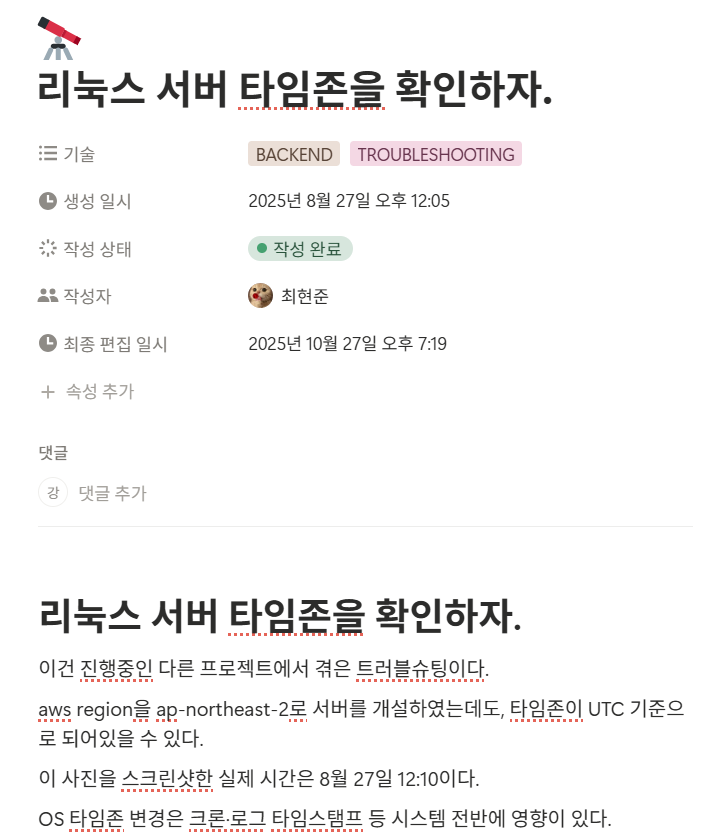
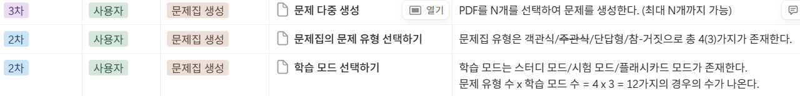
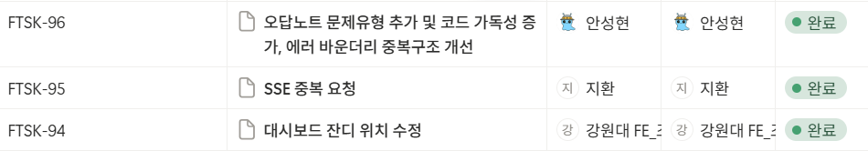
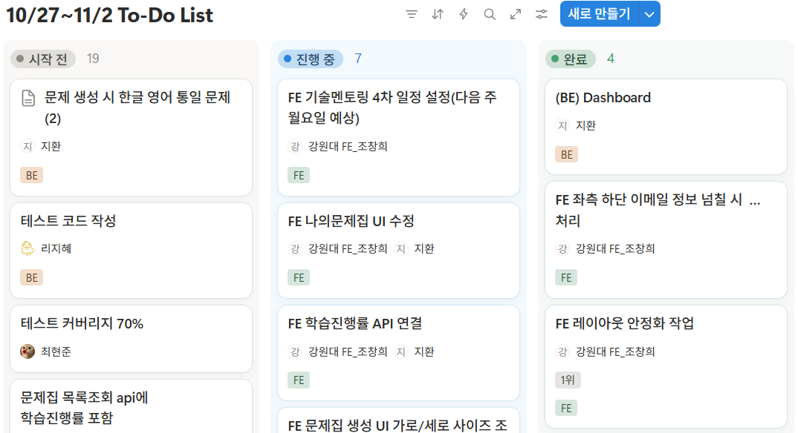

# 문서화 규칙

- 프로젝트를 진행함에 있어 발생할 수 있는 어려움이나 참고할 자료를 문서화합니다.
- 단순한 지식의 공유를 넘어 일정관리와 프론트와 백엔드 간의 소통을 위한 문서화 방법에 대해 설명합니다.

## 기술블로그

- 백엔드/프론트엔드/팀/서버/인증과 관련된 애로사항이나 방식에 대해 자유롭게 공유하고 관련 자료를 첨부합니다.
- 제목을 간단 명료하게하여 추후 누구나 쉽게 접근하고 참고할 수 있도록 해야합니다.
  

## 요구사항 명세서(SRS)

- 프로젝트의 설계와 목표, 구현을 명확히하고 백엔드와 프론트가 소통하여 필요한 API를 명확히 하기 위해 작성합니다.
- 구현 단계를 4단계로 나누고, 자원 현황에 따라 우선 순위를 정하여 기능명과 기능 내용을 작성합니다.
  

## SPRINT

- 크게 프론트와 백엔드의 스프린트를 나누고, 작업번호와 작업명, 담당자, 진행현황을 공유하기 위해 작성합니다.
- 해당 작업번호와 작업명은 깃허브 PR을 올릴 때 PR명으로 기재합니다.
  
  

## TO-DO List

- 주차별로 TO-DO List를 작성하고 계획과 담당을 공유한다.
- 담당자는 가능한 해당 주차에 주어진 목표를 최대한 수행하며, 모두 수행하지 못할 경우 다음 주차로 이월시키도록 한다.
- 담당자는 해당 항목을 상황에 따라 시작 전/진행 중/완료로 분류하여 작업 진척도를 공유할 수 있도록 한다.
  
